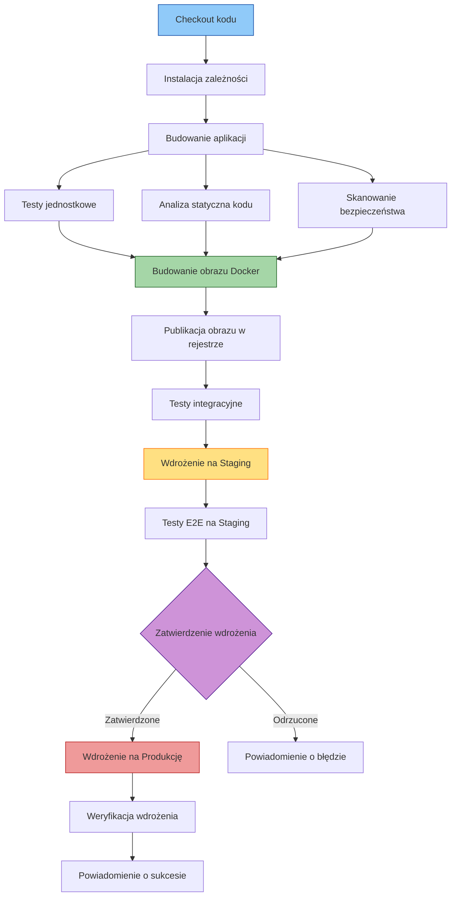

```mermaid
graph TD
    A[Checkout kodu] --> B[Instalacja zależności]
    B --> C[Budowanie aplikacji]
    
    C --> D1[Testy jednostkowe]
    C --> D2[Analiza statyczna kodu]
    C --> D3[Skanowanie bezpieczeństwa]
    
    D1 --> E[Budowanie obrazu Docker]
    D2 --> E
    D3 --> E
    
    E --> F[Publikacja obrazu w rejestrze]
    F --> G[Testy integracyjne]
    G --> H[Wdrożenie na Staging]
    H --> I[Testy E2E na Staging]
    
    I --> J{Zatwierdzenie wdrożenia}
    J -->|Zatwierdzone| K[Wdrożenie na Produkcję]
    J -->|Odrzucone| L[Powiadomienie o błędzie]
    
    K --> M[Weryfikacja wdrożenia]
    M --> N[Powiadomienie o sukcesie]
    
    style A fill:#90CAF9,stroke:#0D47A1
    style E fill:#A5D6A7,stroke:#1B5E20
    style H fill:#FFE082,stroke:#FF6F00
    style K fill:#EF9A9A,stroke:#B71C1C
    style J fill:#CE93D8,stroke:#4A148C
```
